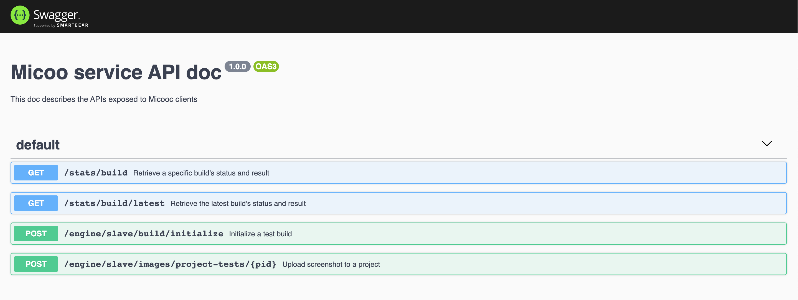
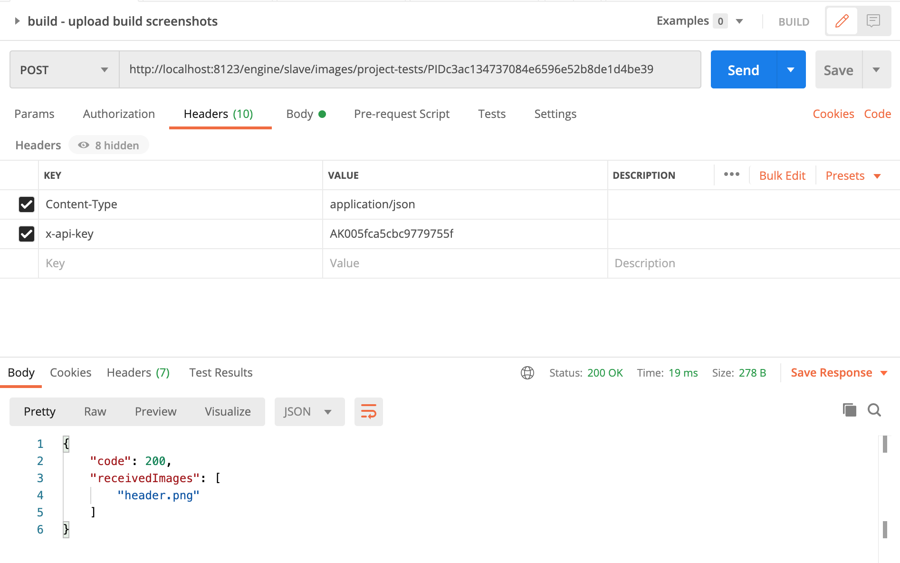
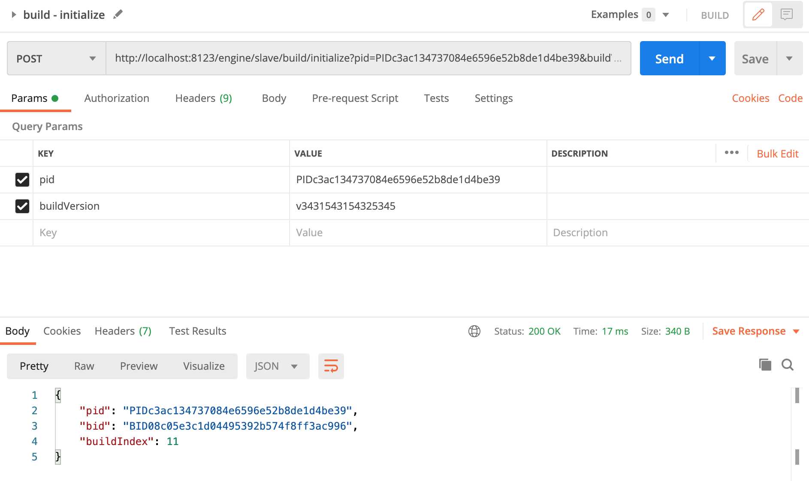
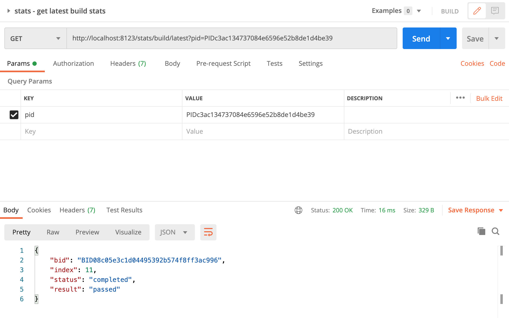
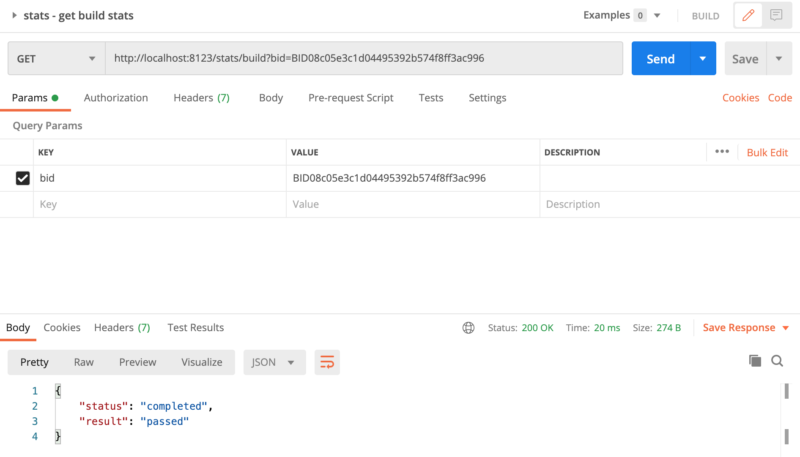

Micoo
--

Micoo is a pixel based screenshots comparison solution for visual regression test, some characters Micoo provides:

* a web application, for inspecting test results, making visual mismatch decision and maintain baseline build,
* an engine service, for comparing the latest screenshots against baseline screenshots, based on pixel difference,
* a methodology, about how to do visual regression test with service,
* quick local setup and server side deployment with Docker Compose,
* basic authentication with a passcode and API key,

Micoo does `NOT`:
* take screenshots from your SUT application,
* process screenshots before doing visual comparison,
* provide Email notification for comparison mismatch,
* provide user management to distinguish `teams`,

So, what Micoo targets at is the most stable and straightforward function for comparing screenshots. Micoo is not, and probably, would never be a powerful thing, like `JVM`, but hope to be an always useful helper, like `string.replace()`.

For more detailed information including installation and usage, please visit this [document](https://arxman.com/micoo/).

### Micooc clients
Micoo provides below client implementation, please check them for detailed installation and usage 
- [NodeJS](https://github.com/Mikuu/Micoo/tree/master/clients/nodejs)
- [Cypress Plugin](https://github.com/Mikuu/Micoo/tree/master/clients/micoocypress)
- [Python](https://github.com/Mikuu/Micoo/tree/master/clients/python)
- [Java](https://github.com/Mikuu/Micoo/tree/master/clients/java)

### Backend APIs
Micoo currently only provides client implementations in limited languages list above, if these clients can't satisfy your requirement, please refer the 
below native Micoo backend APIs, then you can implement the corresponding API consumers in your own coding language.

#### API endpoints definitions
All clients in different language bindings are consuming the same backend API endpoints, the latest backend API endpoints are provided with 
swagger doc, which can be found at `/docs` path of the Micoo service, e.g. if you launch Micoo service at `localhost:8123`, the swagger api 
doc url is `http://localhost:8123/docs`.

#### Consume backend APIs
Currently, there are 4 actions can be applied with Micoo backend service:

- upload screenshot to backend service,
- initialize new test build,
- query a specific build's test stats,
- query the latest build's test stats.

querying test stats, no mater for specific or latest, is independent action, no pre-procedures required. While initializing new test 
build must be taken after completed uploading test screenshots.

#### Consuming backend APIs with Postman
Take an example of using Postman to consume Micoo backend APIs

- upload screenshot to backend service
  > uploading screenshot API only accept 1 image per call, please send multiple requests to upload multiple screenshots
  
  

- initialize new test build
  > once all screenshots are uploaded, call initialize API once, then all previously uploaded screenshots will be taken
  > as tests for the newly created test build.
  
  
  
- query a specific build's test stats
  > build's BID can be returned from initialize API.
  
  
  
- query the latest build's test stats
  > querying the latest build's test stats immediately after initializing build may get status "in progress"
  
  

