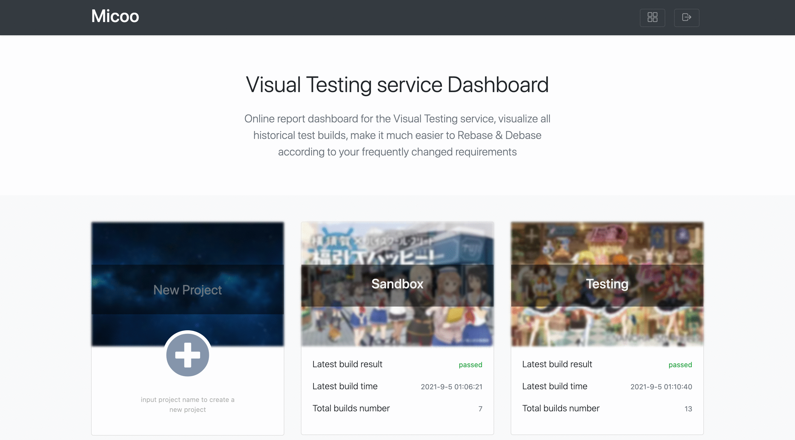

## Micoo
Micoo is a pixel based screenshots comparison solution for visual regression test, some characters Micoo provides:

* a web application, for inspecting test results, making visual mismatch decision and maintain baseline build,
* an engine service, for comparing the latest screenshots against baseline screenshots, based on pixel difference,
* a methodology, about how to do visual regression test with service,
* quick local setup and server side deployment with Docker Compose,

Micoo does `NOT`:
* take screenshots from your SUT application,
* process screenshots before doing visual comparison,
* provide Email notification for comparison mismatch,
* provide user management to distinguish `teams`,

So, what Micoo targets at is the most stable and straightforward function for comparing screenshots. Micoo is not, and probably, would never be a powerful thing, like `JVM`, but hope to be an always useful helper, like `string.replace()`.

For more detailed information including installation and usage, please visit this [document](https://arxman.com/micoo/).

### Micooc clients
Micoo provides below client implementation, please check them for detailed installation and usage 
- [NodeJS](https://github.com/Mikuu/Micoo/tree/master/clients/nodejs)
- [Python](https://github.com/Mikuu/Micoo/tree/master/clients/python)
- [Java](https://github.com/Mikuu/Micoo/tree/master/clients/java)

### Backend APIs
Micoo currently only provides client implementations to limited language list above, if these clients can't satisfy your requirement, please refer the 
below native Micoo backend APIs, then you can implement the corresponding API consumers in your own coding language.

